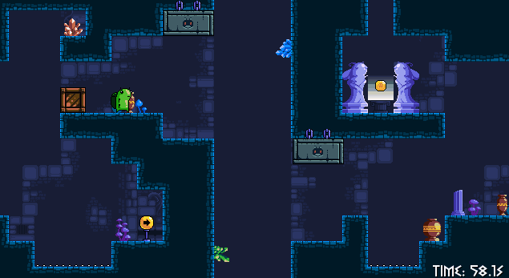

Nymphiad

Nymphiad is a Python platformer inspired by the original Nymphiad game (credits to Wolod). The objective is simple: navigate through the level, avoid obstacles, and reach the end.

I recreated the game independently. The gameplay implementation, game logic, movement, collision system, and other code were written by me. The graphics and level design were taken from the original game.

 

NYMPHIAD — HOW TO PLAY

GOAL
----
Each level has a glowing coin. Reach it to advance to the next level. Beat all 8 levels to win!

Your time is recorded from level 1. Deaths pause the clock - only active play time counts. Try for a fast time!

CONTROLS
--------
Move        A / D   or   Left / Right
Jump        W       or   Up
Grab box    Hold X near a box (to push or pull)
Restart     R

NOTE
To run this game, please run 'pip install pygame-ce' and 'pip install pytmx'
